# Blue Full-Stack Training

## Project Name

Task 01 – Semantic HTML Structure

---

## Project Description

This project was developed as part of the Blue Information Technology Full-Stack Development Training Program.

The objective of this task is to prepare the development environment, create a professional Git and GitHub workflow, and build the initial semantic HTML structure of a company website using HTML5 only.

The project includes the basic layout of a company website without visual styling or responsive design, as these will be implemented in the upcoming tasks.

---

## Technologies and Tools Used

- HTML5
- CSS3
- JavaScript
- Visual Studio Code
- Git
- GitHub
- Google Chrome
- Node.js
- npm
- PHP
- MySQL
- XAMPP
- Composer
- Postman

---

## Project Folder Structure

```text
blue-fullstack-training/
│
└── task-01-responsive-website/
    │
    ├── index.html
    ├── README.md
    │
    ├── css/
    │   └── style.css
    │
    ├── js/
    │   └── main.js
    │
    └── images/
```

---

## Website Structure

The website contains the following sections:

- Header
- Navigation Menu
- Hero Section
- About Us
- Services
- Statistics
- Contact Us
- Contact Form
- Footer

---

## Features

- Semantic HTML5 structure
- Accessible navigation menu
- Hero section with call-to-action button
- About Us section
- Six service cards
- Statistics section
- Contact form with validation
- Footer with company information
- External CSS and JavaScript files linked correctly

---

## How to Run the Project

1. Download or clone the repository.
2. Open the project folder in Visual Studio Code.
3. Open the `index.html` file in your web browser.

or

Use the **Live Server** extension in Visual Studio Code.

---

## Task 01 Progress

During this task, the following work has been completed:

- Installed and verified all required development tools.
- Configured Git and GitHub.
- Created the project repository.
- Organized the required folder structure.
- Built the semantic HTML structure.
- Added all required website sections.
- Linked external CSS and JavaScript files.
- Created meaningful Git commits throughout the development process.

---

## Challenges

Some challenges were encountered during the setup process:

- PHP was initially not recognized from the command line.
- The PHP directory was added to the Windows PATH environment variable.
- Composer was installed and configured successfully after PHP setup.

These issues were resolved successfully.

---

## Future Improvements

The following features will be implemented in the upcoming tasks:

- CSS styling
- Responsive Design
- JavaScript functionality
- Interactive components
- Better UI/UX

---

## Author

Shahd Barmawi

---

## Training Program

Blue Information Technology

Full-Stack Development Training

Task 01

2026

---

## Task 02 Progress

Task 02 focused on transforming the semantic HTML structure created in Task 01 into a complete desktop website layout using organized and reusable CSS.

### Styling Approach

The CSS file was organized into clear sections, including:

- CSS variables
- Reset and base styles
- Typography
- Reusable layout and utility classes
- Header and navigation
- Hero section
- About section
- Services section
- Statistics section
- Contact form
- Footer

CSS custom properties were used to keep colors, spacing, border radius, shadows, and container width consistent across the website.

### Layout Systems

- Flexbox was used for one-dimensional layouts such as the header navigation, buttons, and form structure.
- CSS Grid was used for multi-column layouts such as the hero section, About section, services cards, statistics cards, and contact section.

### Reusable Components

The following reusable classes were created and used throughout the website:

- `.container`
- `.section`
- `.section-title`
- `.section-description`
- `.button`
- `.card`
- `.form-control`

These classes reduce repeated CSS and keep the website design consistent.

### Completed Sections

- Header and navigation
- Hero section
- About section
- Services section with six service cards
- Statistics section
- Contact section and form
- Footer

### Design Decisions

The website uses a simple blue color palette that matches the company identity.

Consistent spacing, card styles, typography, hover effects, and focus states were applied throughout the page.

The current version focuses on the desktop layout. Responsive design and mobile navigation will be implemented in Task 03.

### Challenges

The main challenge was organizing the CSS into reusable sections while keeping the layout simple and consistent.

The issue was solved by using shared classes, CSS variables, Flexbox, and Grid instead of repeating the same declarations.

### Desktop Screenshot

A desktop screenshot of the completed website is available for submission.


---

# Task 03 – Responsive Web Design

## Overview

In Task 03, I transformed the existing desktop website into a fully responsive website that provides a smooth user experience across desktop, tablet, and mobile devices while preserving the original desktop layout.

The responsive implementation was completed using CSS Media Queries together with a JavaScript-powered mobile navigation menu.

---

## Responsive Breakpoints

The website was optimized for the following screen sizes:

- Desktop (1440px)
- Tablet (1024px)
- Mobile (768px)
- Small Mobile (480px)

Each breakpoint adjusts the layout, spacing, typography, grids, navigation, and form elements to ensure the content remains readable and easy to use.

---

## Implemented Features

### Responsive Layout

The following sections were made responsive:

- Header
- Navigation
- Hero Section
- About Section
- Services Section
- Statistics Section
- Contact Section
- Footer

Different layouts were applied depending on the screen width while maintaining the overall design consistency.

---

### Mobile Navigation

A responsive hamburger menu was implemented for mobile devices.

Features include:

- Toggle navigation using JavaScript.
- Accessible button with:
  - `aria-expanded`
  - `aria-controls`
  - `aria-label`
- Navigation closes automatically after selecting a menu item.
- Navigation closes when pressing the **Escape** key.
- Keyboard focus returns to the menu button after closing the menu.

---

## Cross-Device Testing

The website was tested on multiple viewport sizes to ensure proper responsiveness.

The following checks were performed:

- No horizontal scrolling.
- No overlapping content.
- Responsive typography.
- Responsive cards.
- Responsive contact form.
- Responsive footer.
- Working mobile navigation.
- Proper keyboard accessibility.

---

## Challenges

This task required considerably more time because I wanted to fully understand responsive web design instead of simply applying ready-made code.

I spent additional time reviewing:

- CSS Media Queries.
- Responsive layouts.
- Grid and Flexbox behavior across different screen sizes.
- Choosing suitable spacing, font sizes, and layouts for each breakpoint.

I also learned how a **Hamburger Menu** works from both the CSS and JavaScript perspectives, including how to control the navigation state and improve accessibility using ARIA attributes.

Additionally, I reviewed JavaScript events, especially click and keyboard events, to better understand how interactive navigation menus are built.

Although this task took a significant amount of time, it greatly strengthened my understanding of responsive web design and made me much more confident in building websites that work across different devices.

---

## What I Learned

Through this task I gained a much stronger understanding of:

- Responsive Web Design
- CSS Media Queries
- CSS Grid
- Flexbox
- Mobile-first thinking
- Responsive spacing and typography
- JavaScript Events
- Hamburger Navigation
- Accessibility basics using ARIA attributes
- Testing websites on multiple screen sizes

Overall, I feel much more confident creating responsive websites than I was before starting this task.

---

## Screenshots

### Desktop View (1440px)

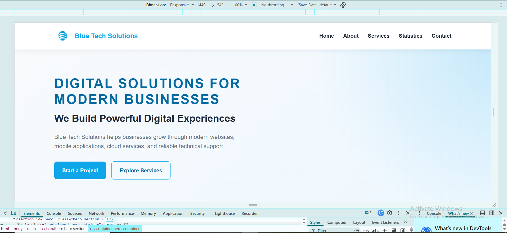

---

### Tablet View (1024px)

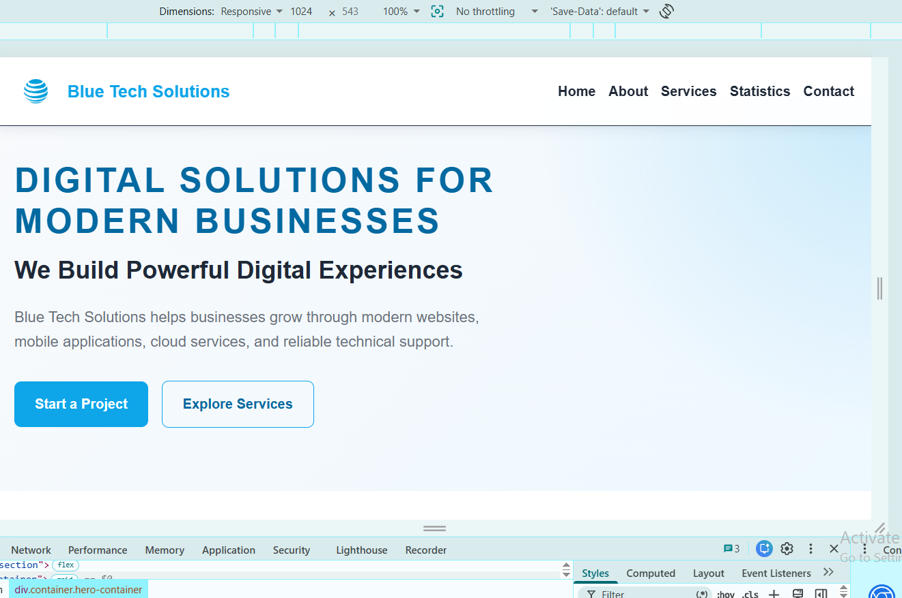

---

### Mobile View (390px)

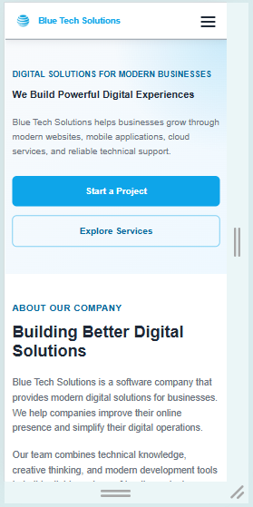

---

### Mobile Navigation

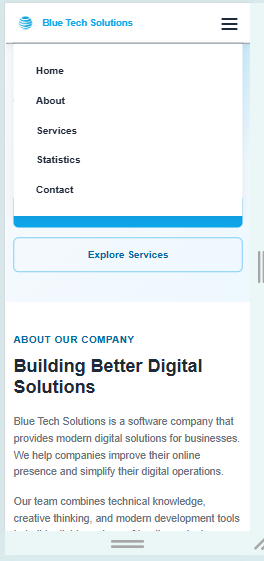

---

## Final Notes

This task helped me understand responsive web development in much greater depth.

Instead of only following instructions, I spent extra time reviewing concepts, experimenting with different responsive solutions, and refining the design until it behaved correctly across all required screen sizes.

The experience significantly improved both my CSS and JavaScript skills, especially in responsive layouts and interactive navigation.

# Task 04 – JavaScript Interactivity & Form Validation

## Overview

In Task 04, I enhanced the website by adding interactive JavaScript features and improving the user experience. The work focused on client-side form validation, accessibility, navigation interactions, animated statistics counters, and responsive behaviors.

---

## Features Completed

### Mobile Navigation

- Implemented a responsive hamburger menu for mobile devices.
- Added open and close functionality using JavaScript.
- Closed the navigation automatically when selecting a menu item.
- Added keyboard support using the Escape key.
- Updated ARIA attributes for better accessibility.

---

### Contact Form Validation

Implemented complete client-side validation for:

- Full Name
- Email Address
- Phone Number (Optional)
- Subject
- Message

Validation includes:

- Required field validation.
- Minimum and maximum character limits.
- Email format validation using Regular Expressions.
- Optional phone number validation.
- Automatic trimming of unnecessary spaces.
- Real-time validation while correcting invalid inputs.
- Field validation on blur.
- Focus moves to the first invalid field after submission.

---

### User Feedback

Added clear visual feedback by:

- Highlighting invalid fields.
- Highlighting valid fields.
- Displaying field-specific error messages.
- Showing a success message after successful validation.
- Resetting the form after successful submission.

---

### Message Character Counter

Implemented a live character counter for the Message field.

- Updates while typing.
- Displays the current number of characters.
- Maximum length of 500 characters.

---

### Back To Top Button

Implemented a floating Back to Top button.

Features:

- Appears only after scrolling down the page.
- Smoothly scrolls back to the top.
- Includes hover and focus effects.
- Uses a custom arrow icon.
- Accessible using keyboard navigation.

---

### Active Navigation

Implemented dynamic navigation highlighting.

- Detects the currently visible section.
- Automatically updates the active navigation link.
- Uses the Intersection Observer API.

---

### Statistics Counter Animation

Implemented animated statistics counters.

Features:

- Numbers animate from 0 to their target values.
- Animation starts only when the Statistics section enters the viewport.
- Runs only once.
- Respects reduced motion user preferences.

---

## Accessibility Improvements

Implemented several accessibility enhancements including:

- Proper ARIA attributes.
- Keyboard navigation support.
- Focus management.
- Accessible validation feedback.
- Semantic interactive controls.

---

## JavaScript Concepts Practiced

During this task I practiced:

- DOM Selection
- Event Listeners
- Functions
- Arrow Functions
- Conditional Statements
- Loops
- Regular Expressions
- Dataset Attributes
- Class Manipulation
- Form Validation
- Intersection Observer 
- requestAnimationFrame()
- Window Scrolling 

---

## Challenges

During this task I spent additional time reviewing responsive web design concepts to better understand how different layouts behave across screen sizes.

I also learned how to build a responsive hamburger navigation menu, manage JavaScript events more effectively, and improve accessibility when working with interactive components.

Another challenge was organizing the validation logic without repeating code. Creating reusable helper functions made the implementation cleaner and easier to maintain.

Finally, I became much more comfortable working with DOM manipulation, event handling, and client-side form validation.

---
# Task 05 – Frontend QA, Accessibility, Performance & Deployment

## Overview

This task focused on testing, improving, and validating the website before deployment. Functional testing, accessibility improvements, responsive verification, performance auditing, and GitHub Pages deployment were completed.

---

## Completed Tasks

- Performed functional regression testing.
- Fixed identified frontend issues.
- Improved keyboard accessibility.
- Added a skip link for keyboard users.
- Verified responsive behavior across multiple screen sizes.
- Tested the website on Google Chrome and Microsoft Edge.
- Verified GitHub Pages deployment.
- Performed a Lighthouse audit.
- Documented QA findings and evidence.

---

## Technologies & Tools

- HTML5
- CSS3
- JavaScript 
- Git
- GitHub
- GitHub Pages
- Chrome DevTools
- Lighthouse

---

## Lighthouse Results

| Category | Score |
|----------|------:|
| Performance | **100** |
| Accessibility | **96** |
| Best Practices | **100** |
| SEO | **91** |

---

## QA Testing

The following areas were tested successfully:

- Desktop navigation
- Mobile navigation
- Active navigation highlighting
- Contact form validation
- Character counter
- Statistics animation
- Back-to-top button
- Keyboard navigation
- Responsive layouts
- Cross-browser compatibility
- GitHub Pages deployment
- Browser console
- Lighthouse audit

---

## Screenshots
### Final Desktop View

The final responsive desktop layout after completing all project tasks.

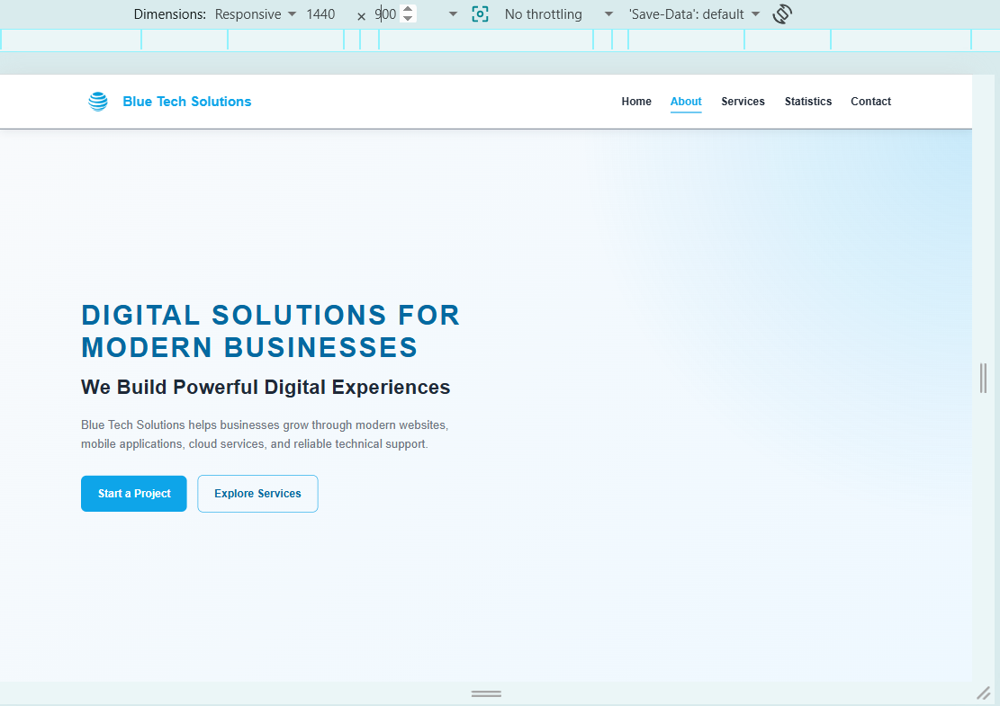

---

### Final Mobile View

Responsive mobile layout with the mobile navigation menu and optimized content.

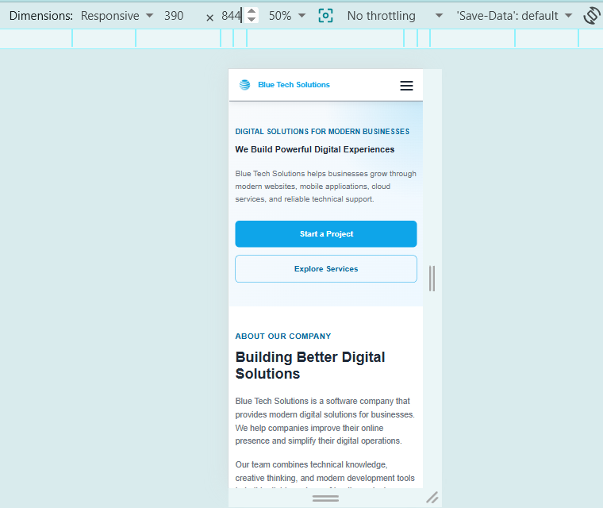

---

### Keyboard Focus

Keyboard focus indicator while navigating the website using the Tab key.

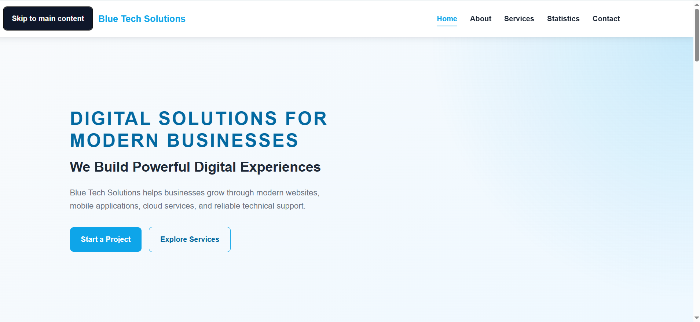

---

### Contact Form Validation

Validation messages displayed when submitting invalid form data.

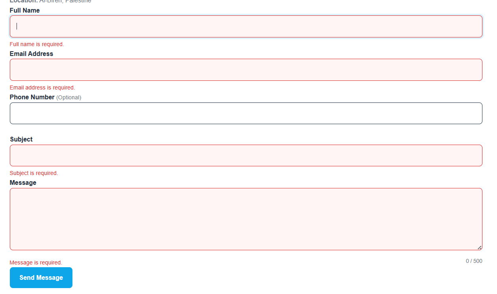

---

### Successful Form Submission

The contact form after successful validation.

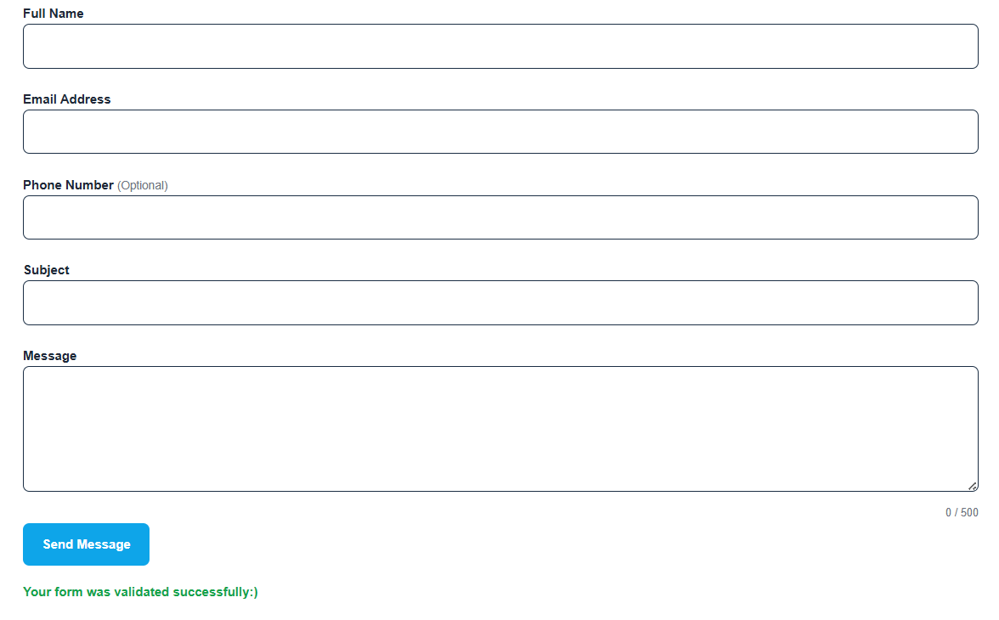

---

### QA Issue – Active Navigation

During testing, the Contact section was visible while the Statistics navigation item remained active. This issue was fixed by updating the active navigation logic.

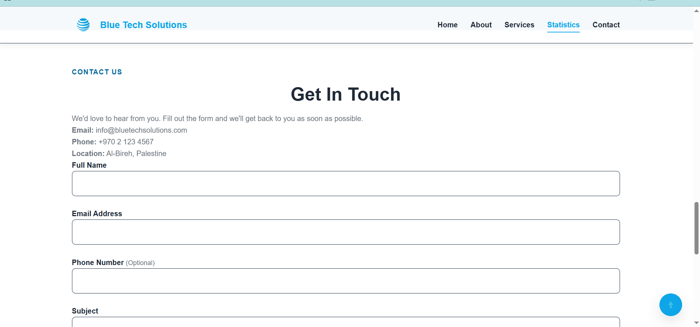

---

### Lighthouse Report

Final Lighthouse audit after deployment.

- Performance: **100**
- Accessibility: **96**
- Best Practices: **100**
- SEO: **91**

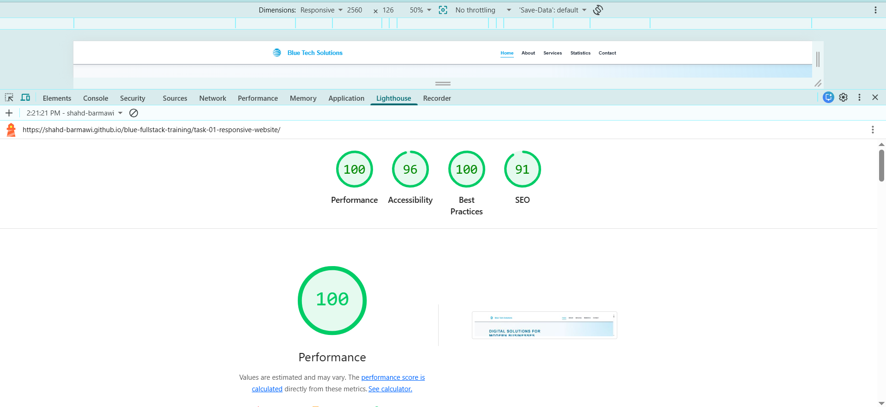

---

### Browser Console

The deployed website was tested to ensure there were no JavaScript errors.

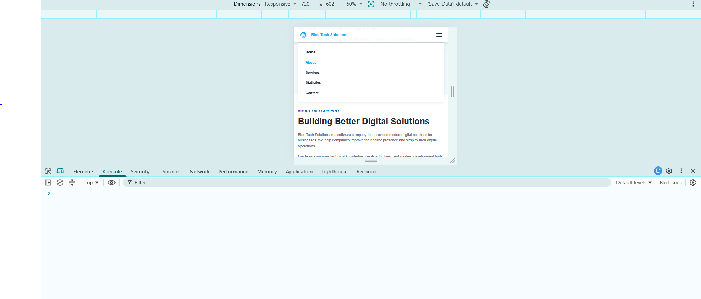

---

## Challenges & Lessons Learned

During this task, I improved my understanding of frontend quality assurance by identifying and fixing issues before deployment. I also learned how to:

- Perform functional and accessibility testing.
- Test responsive layouts on different screen sizes.
- Verify browser compatibility.
- Deploy a website using GitHub Pages.
- Analyze website quality using Lighthouse.
- Document QA findings and testing evidence.

---
