# Task 07 – Vue.js Fundamentals

## Overview

This project is a Vue.js version of the previous responsive website developed during Task 06.

The application was rebuilt using Vue 3 and Vite by dividing the website into reusable components while keeping the same design and functionality.

---

## Technologies Used

- Vue 3
- Vite
- JavaScript
- HTML5
- CSS3
- JSONPlaceholder REST API

---

## Features

### Component-Based Architecture

The application was divided into reusable Vue components including:

- Site Header
- Hero Section
- About Section
- Services Section
- Service Card
- Statistics Section
- Projects Section
- Project Card
- Posts Section
- Contact Section
- Site Footer

---

### Vue Concepts Used

- Vue Components
- Props
- Custom Events
- ref()
- computed()
- v-for
- v-if / v-else
- v-model
- onMounted()

---

### Project Filtering

Projects can be filtered by category:

- All
- Web
- Mobile
- UI/UX

Filtering is implemented using Vue's reactive state and computed properties.

---

### REST API Integration

The application loads posts dynamically from:

https://jsonplaceholder.typicode.com/posts

Implemented features:

- Loading state
- Error handling
- Retry button
- Search functionality
- Dynamic rendering using Vue

---

## Screenshots

### Vue Homepage

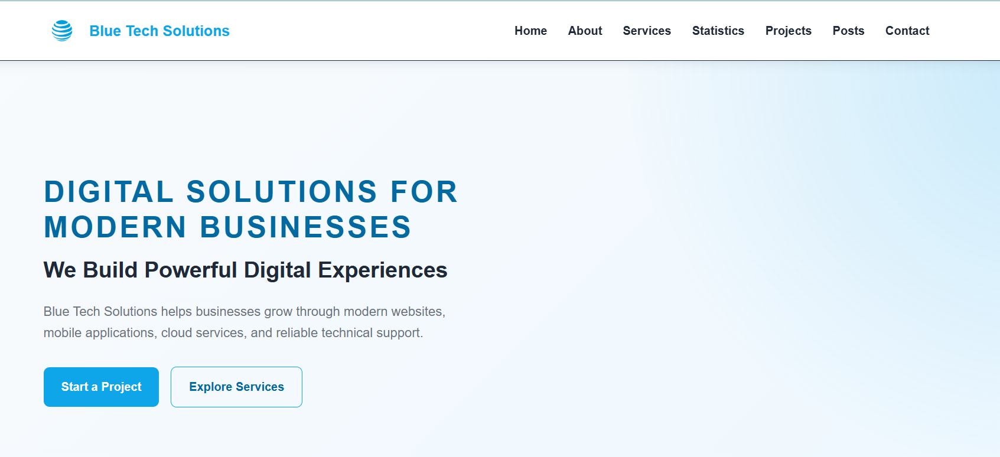

---

### Components Structure

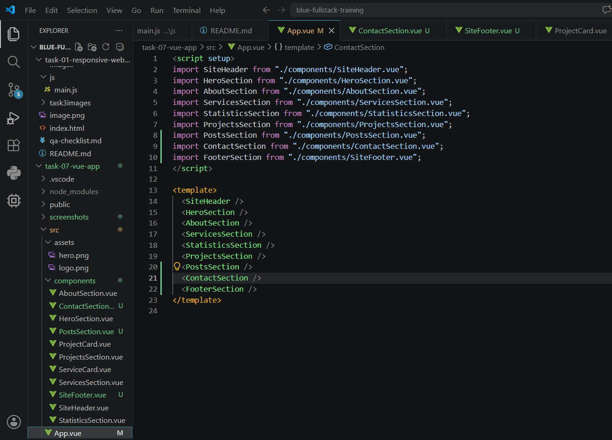

---

### Project Filtering

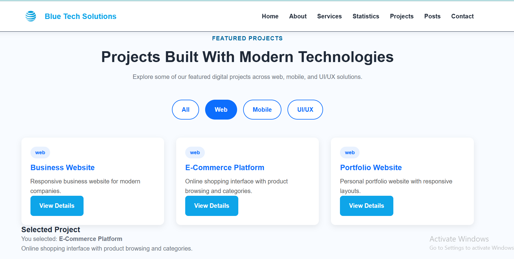

---

### REST API Integration

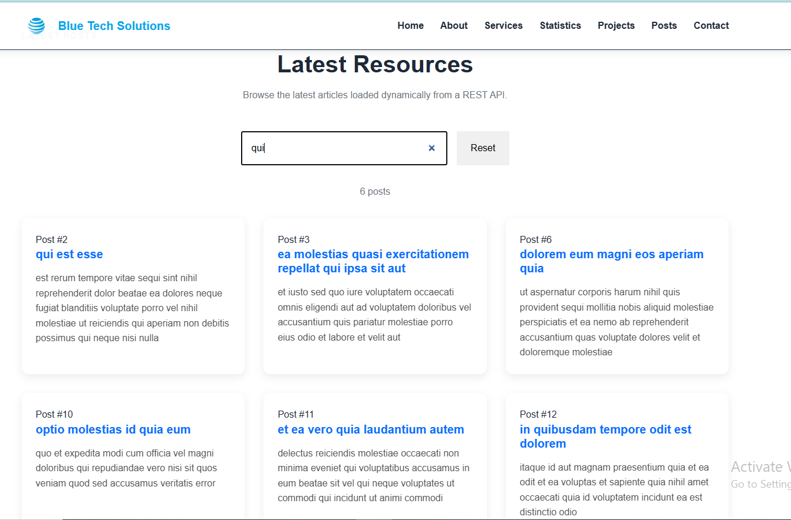

---

## Learning Outcomes

Through this task I learned how to:

- Build applications using Vue 3 and Vite.
- Create reusable components.
- Pass data using Props.
- Communicate between components using Custom Events.
- Manage reactive state with ref().
- Create computed properties.
- Render dynamic lists using v-for.
- Build user interactions using Vue directives.
- Integrate REST APIs inside Vue components.
- Handle loading, error, retry, and search states.

---

## Project Structure

```text
task-07-vue-app
│
├── src
│   ├── components
│   │   ├── SiteHeader.vue
│   │   ├── HeroSection.vue
│   │   ├── AboutSection.vue
│   │   ├── ServicesSection.vue
│   │   ├── ServiceCard.vue
│   │   ├── StatisticsSection.vue
│   │   ├── ProjectsSection.vue
│   │   ├── ProjectCard.vue
│   │   ├── PostsSection.vue
│   │   ├── ContactSection.vue
│   │   └── SiteFooter.vue
│   │
│   ├── App.vue
│   └── main.js
│
├── screenshots
├── package.json
└── README.md
```

---

## Author

**Shahd Barmawi**

---

# Task 08 – Vue Router, Dynamic Routes, and Reusable API Logic

## Overview

In Task 08, the existing Vue application was extended into a multi-page Single Page Application (SPA) using Vue Router.

The task focused on route-level navigation, dynamic post routes, reusable API logic, route-aware search, error handling, and maintaining the existing responsive design.

## Features Completed

- Configured Vue Router using `createRouter` and `createWebHistory`.
- Added route-level views for:
  - Home
  - Services
  - Posts
  - Contact
- Used `RouterView` to render pages dynamically.
- Replaced traditional navigation links with `RouterLink`.
- Added lazy loading for selected route-level views.
- Added smooth scrolling for section-based navigation.
- Added a dynamic route for individual posts:
  - `/posts/:id`
- Used `useRoute()` to read the post ID from the URL.
- Used `useRouter()` for programmatic navigation.
- Added a reusable `usePosts` composable for API logic.
- Added loading, error, and retry states.
- Added a `View Details` link for each post.
- Added a `Back to Posts` action on the post details page.
- Added a catch-all 404 Not Found route.
- Synchronized post search with the URL query string.
- Search state is restored after refreshing the page.

## Routes

| Route              | Description           |
| ------------------ | --------------------- |
| `/`                | Home page             |
| `/services`        | Services and Projects |
| `/posts`           | Posts list            |
| `/posts/:id`       | Dynamic post details  |
| `/contact`         | Contact page          |
| `/:pathMatch(.*)*` | 404 Not Found page    |

## Reusable Composable

The posts API logic was moved into:

`src/composables/usePosts.js`

The composable manages:

- Posts data
- Single post data
- Loading state
- Error state
- Loading all posts
- Loading a post by ID
- Retry behavior

This keeps API logic reusable and avoids duplicating the same fetching logic across components and views.

## Route-Aware Search

The Posts page synchronizes the search value with the URL query string.

Example:

`/posts?q=qui`

Refreshing or directly opening this URL restores the search value and filtered results.

## Error Handling

The application includes handling for:

- API loading states
- API request errors
- Retry actions
- Invalid post IDs
- Unknown routes using a 404 page

## Evidence

### Route-Level Navigation

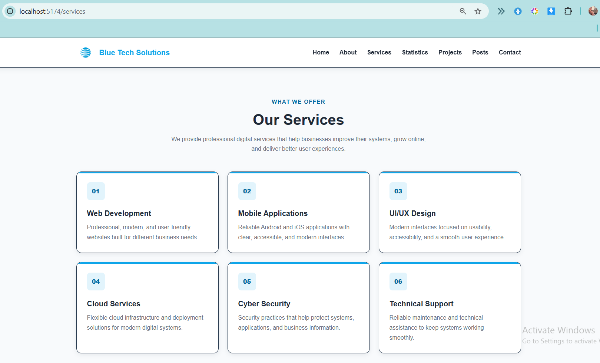

### Dynamic Post Details

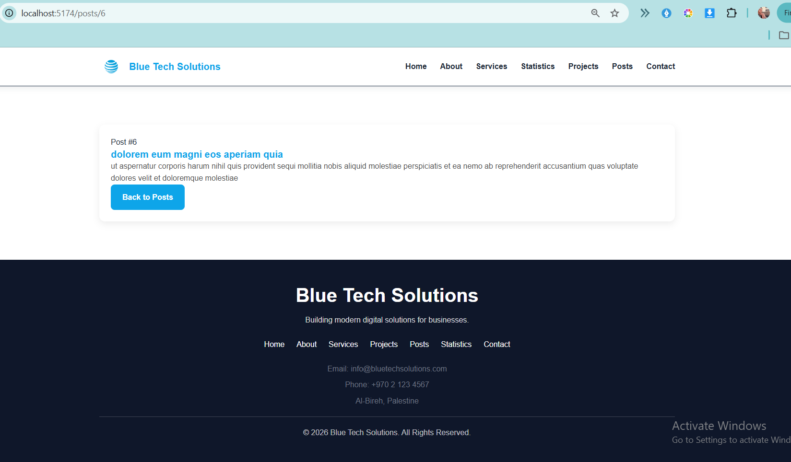

### Route-Aware Search

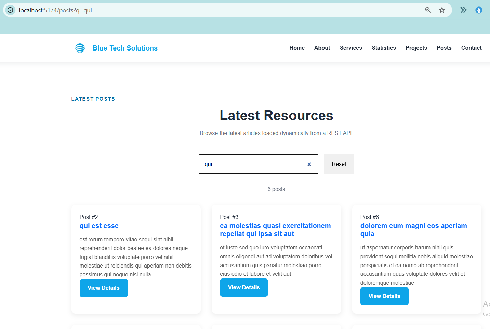

## Technologies Used

- Vue 3
- Vue Router
- Composition API
- JavaScript
- REST API
- JSONPlaceholder
- HTML5
- CSS3
- Vite

## API

Posts are loaded from the JSONPlaceholder REST API.

## Testing

The application was tested for:

- Route navigation
- Browser Back and Forward navigation
- Direct route access
- Page refresh on nested routes
- Dynamic post routes
- Invalid post IDs
- Unknown routes
- Search query persistence
- API loading and error states
- Retry functionality
- Responsive behavior

## Remaining Work

None.

## Challenges

One of the main challenges was transitioning from a single-page section-based navigation structure to Vue Router.

The previous implementation relied heavily on anchor links such as `#posts`, `#services`, and `#contact`. After introducing Vue Router, these links initially conflicted with the new route-based navigation.

Another challenge was understanding the difference between static routes, dynamic routes, route parameters, and query parameters. Refactoring the existing API logic into a reusable composable also required restructuring code that was previously located directly inside the component.

These issues were resolved by separating route-level views, using `RouterLink`, introducing the `usePosts` composable, and synchronizing search state with the route query.

## Latest Progress

Task 08 has been completed with routing, dynamic post details, reusable API logic, route-aware search, error handling, and 404 handling.

---

## Task 09 - Pinia State Management, Forms & API Mutations

### Overview

This task extends the Vue application by introducing Pinia for shared state management, persistent favorites using localStorage, and a Create Post form with validation and API mutation handling.

The implementation includes:

- Centralized posts state using Pinia
- Persistent favorite posts
- Shared favorite count
- Create Post form
- Field-level validation
- Live validation feedback
- POST request using fetch and async/await
- Loading and disabled states during submission
- Success and error feedback
- Retry functionality
- Locally persisted created posts

---

## Pinia Store Architecture

The application uses Pinia to manage shared posts and favorites state.

The posts store is located at:

`src/stores/posts.js`

The store manages:

- Posts
- Loading state
- API errors
- Favorite post IDs
- Favorite count
- Favorite posts
- Post submission state
- Submission errors
- Created posts

Shared state is kept inside Pinia so that the Posts, Post Details, Favorites, and Create Post views can work with the same source of data.

Temporary form values and validation messages remain local to `CreatePostView.vue`.

---

## Persistent Favorites

Users can add and remove posts from their favorites.

Favorite post IDs are stored in `localStorage` and restored when the application starts.

This allows favorites to remain available after refreshing the browser.

The favorite state is shared between:

- Posts page
- Post Details page
- Favorites page
- Navigation favorite count

### Favorite Count and Post State

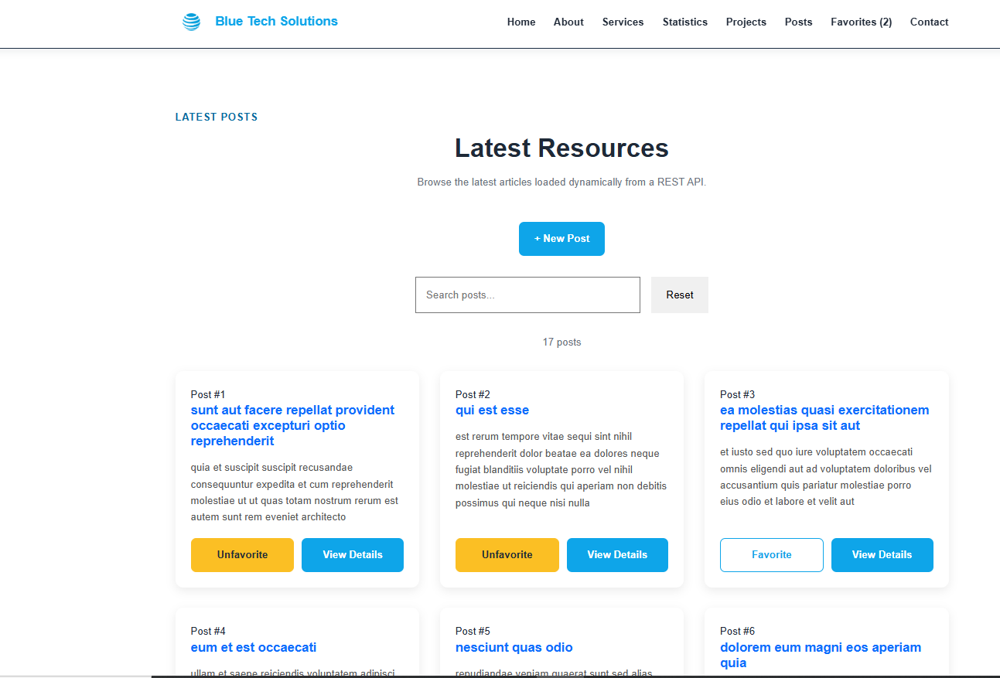

### Favorites View

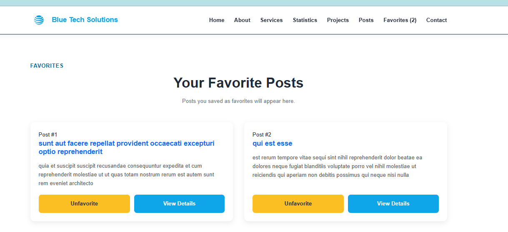

---

## Create Post Form

A route-level Create Post page is available at:

`/posts/create`

The form contains:

- Title
- Body
- User ID

Form values are managed using Vue `v-model`.

No direct DOM selectors are used to read form values.

---

## Form Validation

The Create Post form validates user input before submission.

Validation rules include:

- Title is required
- Title cannot contain only whitespace
- Title must contain at least 5 characters
- Body is required
- Body cannot contain only whitespace
- Body must contain at least 10 characters
- User ID is required
- User ID must be a positive integer
- Body content is limited to 500 characters

A character counter is displayed for the Body field.

Field-level validation messages are displayed next to invalid fields and are updated when the user corrects the input.

### Validation Example

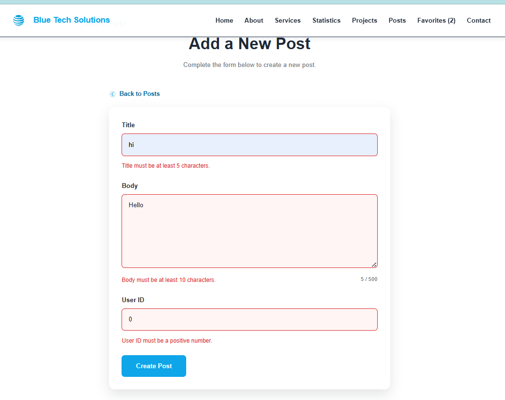

---

## POST Request

Valid form data is submitted to the JSONPlaceholder Posts API using `fetch()` and `async/await`.

Endpoint:

`https://jsonplaceholder.typicode.com/posts`

The request uses:

- HTTP `POST` method
- `Content-Type: application/json`
- A JSON request body containing `title`, `body`, and `userId`

The application checks `response.ok` before treating the request as successful.

While the request is being processed:

- The submit button is disabled
- Form controls are disabled
- The button displays a loading state
- Duplicate submissions are prevented

---

## Success Flow

After a successful POST request:

- A success message is displayed
- The returned post ID is displayed
- The form fields are reset
- A Create Another Post action is available
- The created post is added to the local posts list
- Locally created posts are saved in `localStorage`

### Successful POST Request

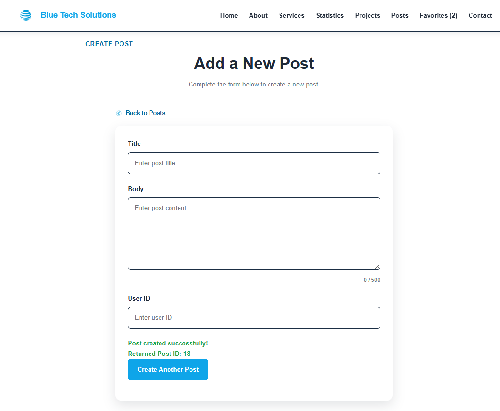

---

## Error and Retry Flow

If the POST request fails:

- The entered form values are preserved
- A clear error message is displayed
- A Retry button is provided
- The user can retry the request without re-entering the form data

The failure flow was temporarily tested using an invalid endpoint to confirm that the error UI and Retry functionality worked correctly.

The correct JSONPlaceholder endpoint was restored after testing.

---

## JSONPlaceholder Limitation

JSONPlaceholder simulates successful POST requests and returns a created object, but the new record is not permanently stored on the JSONPlaceholder server.

Because of this limitation, locally created posts are also stored in `localStorage` in this training application so that they can remain visible after refreshing the browser.

---

## Task 09 Screenshots

### 1. Favorite Count


### 2. Favorites View


### 3. Invalid Create Post Form


### 4. Successful Create Post


---

# Task 10 – Frontend QA, Testing, and Handover

## Overview

Task 10 focused on frontend quality assurance, automated testing, production validation, accessibility, responsive behavior, and final project stabilization.

The application was fully tested in the production environment using the Vite preview server to ensure that all features implemented in previous tasks continued to work correctly.

---

## QA Process

The QA process covered the following areas:

- Functional testing
- Navigation testing
- Responsive testing
- Accessibility testing
- API testing
- State management testing
- Browser console testing
- Production build testing
- Final regression testing

---

## Issues Identified and Fixed

The following issues were discovered during the QA process and were fixed before the final submission:

| Issue                                              | Resolution                                                            |
| -------------------------------------------------- | --------------------------------------------------------------------- |
| Hero buttons did not navigate correctly.           | Replaced anchor elements with RouterLink components.                  |
| Active navigation did not update while scrolling.  | Added reusable active-navigation logic.                               |
| About section button did not navigate correctly.   | Replaced the anchor link with RouterLink.                             |
| Statistics counters did not animate correctly.     | Added a reusable statistics counter composable.                       |
| Mobile navigation menu did not open.               | Added reusable mobile-menu logic.                                     |
| Project details interaction required improvements. | Updated the project interaction flow and verified the final behavior. |

---

## Accessibility Testing

The following accessibility checks were completed successfully:

- Keyboard navigation using Tab and Shift + Tab
- Navigation link accessibility
- Button accessibility
- Form accessibility
- Visible focus indicators
- Mobile menu closing with the Escape key
- Image alternative text verification
- Form labels verification
- Validation message visibility
- Content readability across different screen sizes

---

## Responsive Testing

The application was tested using the following screen sizes:

| Screen Width | Result |
| ------------ | ------ |
| 320px        | Passed |
| 375px        | Passed |
| 768px        | Passed |
| 1024px       | Passed |
| 1440px       | Passed |

The following areas were verified:

- Navigation
- Mobile menu
- Forms
- Posts
- Favorites
- Project cards
- Buttons
- Content layout

No horizontal scrolling, clipping, or overlapping elements were found.

---

## Automated Testing

The application uses:

- Vitest
- Vue Test Utils
- jsdom

The automated tests covered:

- Adding favorites
- Removing favorites
- Restoring favorites from localStorage
- Empty Create Post validation
- Minimum-length validation
- Successful Create Post submission

### Test Results

```text
Test Files: 2 passed
Tests: 6 passed
```

Run the test suite:

```bash
npm test
```

---

## Environment Configuration

The application uses an environment variable for the API configuration.

Create a `.env` file:

```env
VITE_API_BASE_URL=https://jsonplaceholder.typicode.com
```

The required configuration is also documented inside:

```text
.env.example
```

---

## Production Build Verification

Production verification was completed successfully.

Commands used:

```bash
npm run build
npm run preview
```

The following features were verified in the production environment:

- Routing
- API requests
- Pinia state management
- localStorage persistence
- Favorites
- Create Post
- Post Details
- Search functionality

---

## Final Regression Testing

The following features were verified after all fixes were completed:

- Home page
- Services page
- Projects section
- Posts page
- Post Details page
- Favorites page
- Create Post page
- Contact page
- Navigation
- Active navigation
- Mobile navigation
- Search functionality
- Favorites synchronization
- Create Post validation
- Retry functionality
- Responsive behavior
- Console and network requests

All regression tests passed successfully.

---

## Known Issues

No unresolved issues were identified after the final testing process.

---

## Final Status

- Production build: Passed
- Automated tests: Passed
- QA testing: Passed
- Accessibility testing: Passed
- Responsive testing: Passed
- Final regression testing: Passed

The frontend is ready for deployment and future development.

---

# Task 15 – Full-Stack Integration: Vue Frontend with Laravel REST API

## Overview

Task 15 focused on integrating the existing Vue frontend with the Laravel REST API developed during the backend tasks.

The temporary JSONPlaceholder API used in the previous frontend tasks was replaced with the local Laravel API. The application now supports real authentication, backend categories, CRUD operations, server-side filtering and pagination, authorization, validation handling, and state synchronization with the Laravel backend and MySQL database.

---

## Technologies Used

### Frontend

- Vue 3
- Vite
- Vue Router
- Pinia
- JavaScript
- Fetch API
- HTML5
- CSS3

### Backend

- Laravel
- Laravel REST API
- Laravel Sanctum / Token Authentication
- PHP
- MySQL

---

## Full-Stack Features

The integrated application includes:

- User login using the Laravel API
- Logout functionality
- Authenticated user retrieval
- Protected frontend routes
- Authenticated API requests
- Posts loaded from Laravel
- Categories loaded from Laravel
- Create Post
- Update Post
- Delete Post
- Post ownership and authorization
- Backend validation handling
- Server-side search/filtering
- Backend pagination
- Pinia state synchronization
- Loading, empty, and error states
- Network failure handling
- 401 unauthenticated handling
- 403 forbidden handling
- 404 missing post handling
- Responsive frontend behavior

---

## Running the Full-Stack Application

The Vue frontend and Laravel backend remain separate applications and must both be running locally.

### 1. Laravel Backend

Open a terminal inside the Laravel backend project.

Install the backend dependencies if needed:

```bash
composer install
```

Create the Laravel environment file from `.env.example` if it does not already exist.

Configure the database connection in the Laravel `.env` file:

```env
DB_CONNECTION=mysql
DB_HOST=127.0.0.1
DB_PORT=3306
DB_DATABASE=your_database_name
DB_USERNAME=your_database_username
DB_PASSWORD=your_database_password
```

Do not commit real database passwords or other secrets to the repository.

Generate the application key if needed:

```bash
php artisan key:generate
```

Run the database migrations:

```bash
php artisan migrate
```

If seeders are used, run:

```bash
php artisan db:seed
```

Start the Laravel development server:

```bash
php artisan serve
```

The backend normally runs at:

```text
http://127.0.0.1:8000
```

The REST API base URL is:

```text
http://127.0.0.1:8000/api
```

---

### 2. Vue Frontend

Open another terminal inside the Vue frontend project.

Install the frontend dependencies:

```bash
npm install
```

Create or update the frontend `.env` file:

```env
VITE_API_BASE_URL=http://127.0.0.1:8000/api
```

Start the Vue development server:

```bash
npm run dev
```

The frontend normally runs at:

```text
http://localhost:5173
```

Both the Laravel server and Vue development server must be running while using the full-stack application.

---

## Frontend API Configuration

The Laravel API base URL is stored in the Vue environment configuration instead of being hardcoded throughout the application.

```env
VITE_API_BASE_URL=http://127.0.0.1:8000/api
```

The application accesses the configured value using:

```javascript
const API_BASE_URL = import.meta.env.VITE_API_BASE_URL;
```

This allows the backend URL to be changed without modifying individual Vue components or stores.

Passwords, authentication tokens, database credentials, and other secrets are not hardcoded in the source code.

---

## Authentication Flow

Authentication is handled through the Laravel backend.

The authentication flow is:

1. The user enters their credentials in the Vue Login page.
2. Vue sends the credentials to the Laravel login endpoint.
3. Laravel validates the credentials.
4. After successful authentication, the frontend stores the returned authentication token.
5. Authenticated API requests include the token in the `Authorization` header.
6. Vue retrieves the authenticated user through the backend `/api/me` endpoint.
7. The authenticated user's name is displayed in the interface.
8. Protected Vue routes require authentication.
9. Logout clears the local authentication state and token.

Protected requests include:

```text
Authorization: Bearer <authentication-token>
```

No access token is hardcoded in the source code.

---

## Posts Integration

The Posts view now loads data from the Laravel REST API instead of JSONPlaceholder.

Posts are retrieved from:

```text
/api/posts
```

The frontend displays backend data including:

- Post title
- Post body
- Status
- Category
- Author

The application also provides clear loading, empty, retry, and error states when loading posts.

---

## Categories Integration

Categories are retrieved from:

```text
/api/categories
```

The Create Post and Edit Post forms use categories returned by Laravel instead of a hardcoded frontend category list.

This keeps the frontend category options synchronized with the backend database.

---

## Create Post Integration

Authenticated users can create posts through the Vue Create Post form.

The frontend sends the form data to the Laravel API using an authenticated `POST` request.

The submitted data includes:

- Title
- Body
- Category
- Status

Laravel validates the request and stores valid posts in MySQL.

Backend validation errors are displayed clearly in the Vue form next to the relevant fields.

After successful creation, the frontend state is synchronized with the backend without requiring a full browser refresh.

---

## Update and Delete Integration

Authenticated users can update or delete posts that they own.

### Update

The Edit Post interface sends an authenticated `PUT` request to the Laravel API.

After a successful update:

- Laravel persists the changes in MySQL.
- Pinia updates the frontend state.
- The updated information appears without requiring a browser refresh.

### Delete

The Delete action sends an authenticated `DELETE` request to Laravel.

After successful deletion:

- The post is removed from the backend database.
- The frontend posts state is synchronized.
- Pagination information is refreshed.
- Deleted posts are also removed from the local favorites state when necessary.

Laravel authorization rules determine whether the authenticated user is allowed to modify a post.

If Laravel returns `403 Forbidden`, the frontend displays an authorization error and does not pretend that the operation succeeded.

---

## Filtering and Backend Pagination

Post search and pagination are performed through the Laravel backend.

For example:

```text
/api/posts?page=1&search=Vue
```

The search value is sent to Laravel as a query parameter.

Laravel returns only the matching records for the requested page together with pagination metadata.

The Vue interface uses this metadata to display:

- Previous page
- Page numbers
- Next page
- Current page
- Total number of matching posts

The application does not fetch all database records and simulate server-side pagination in the browser.

---

## Pinia State Synchronization

Pinia manages the shared posts state used throughout the application.

After normal Create, Update, and Delete operations, the frontend state remains synchronized with Laravel without requiring a full browser refresh.

Paginated post data and individual post data are handled separately so that opening a single post does not incorrectly modify the current paginated list.

The centralized store also avoids duplicating the same API request logic across multiple Vue components.

---

## Error Handling

The integrated application was tested for the required API and authentication error scenarios.

### Backend / Network Failure

If the Laravel backend is unavailable, Vue displays a clear API error message and provides a Retry action.

### Invalid Login

Invalid credentials result in a clear authentication error and the user remains unauthenticated.

### Validation Errors

Backend validation errors returned by Laravel are displayed in the frontend form.

### Unauthenticated Requests

Protected frontend routes redirect unauthenticated users to the Login page.

Protected API requests also handle unauthenticated responses appropriately.

### Forbidden Update or Delete

Users cannot update or delete posts they do not own.

If Laravel returns a `403 Forbidden` response, the frontend displays an appropriate error message.

### Missing Post

When a requested post does not exist, the application handles the Laravel `404` response and displays:

```text
Post not found.
```

The user can retry the request or return to the Posts page.

---

## End-to-End Full-Stack Flow

The integrated application follows this general flow:

```text
User
  ↓
Vue Frontend
  ↓
Fetch API
  ↓
Laravel REST API
  ↓
Authentication / Validation / Authorization
  ↓
Laravel Models
  ↓
MySQL Database
  ↓
Laravel JSON Response
  ↓
Pinia State
  ↓
Updated Vue Interface
```

For example, when an authenticated user creates a post:

1. The user completes the Create Post form in Vue.
2. Vue sends an authenticated request to Laravel.
3. Laravel authenticates the user.
4. Laravel validates the submitted data.
5. Laravel stores the post in MySQL.
6. Laravel returns a JSON response.
7. Pinia synchronizes the frontend posts state.
8. The new post appears in the Vue application without requiring a full browser refresh.

---

## End-to-End Verification

The full-stack integration was verified using the Vue interface, browser developer tools, Laravel API, and database checks.

The following flows were tested successfully:

- Successful login
- Invalid login
- Authenticated user state
- Loading posts from Laravel
- Loading categories from Laravel
- Create Post
- Update Post
- Delete Post
- Backend validation
- Search/filtering
- Backend pagination
- Pinia state synchronization
- Logout
- Protected routes
- Forbidden actions
- Missing post (`404`)
- Backend/network failure
- Responsive frontend behavior

Frontend-created data was also verified through Laravel and MySQL to confirm that the operations were persisted by the backend.

---

## Task 15 Status

- Laravel API integration: Completed
- Authentication integration: Completed
- Protected requests: Completed
- Posts integration: Completed
- Categories integration: Completed
- Create Post integration: Completed
- Update and Delete integration: Completed
- Backend filtering: Completed
- Backend pagination: Completed
- State synchronization: Completed
- Required error scenarios: Completed
- End-to-end verification: Completed
- Responsive verification: Passed

Task 15 full-stack integration is complete.

---

# Tasks 16 & 17 – Full-Stack Stabilization, Testing, Security & Handover

## Overview

Tasks 16 and 17 focused on completing and stabilizing the existing Vue and Laravel full-stack integration.

The work included frontend route protection, authorization-aware UI behavior, reusable API handling, improved UX states, automated Laravel and Vue tests, security configuration review, regression testing, and final full-stack documentation.

The existing Task 15 integration was kept and improved rather than rebuilding the application from scratch.

---

## Frontend Route Protection

Protected frontend routes were reviewed and improved.

The following pages require authentication:

- My Posts
- Create Post
- Favorites
- Edit functionality

Unauthenticated visitors attempting to open protected routes are redirected to the Login page.

The intended destination is preserved using a redirect query parameter.

Example:

```text
/posts/create
```

redirects an unauthenticated user to:

```text
/login?redirect=/posts/create
```

After successful login, the user is returned to the originally requested page.

Invalid or expired authentication tokens are also handled cleanly.

When Laravel rejects the stored token:

- The invalid authentication state is cleared.
- The stored user is removed.
- The application returns to the Login state.
- Protected pages remain inaccessible.

---

## Authorization-Aware UI

The Vue interface now reflects Laravel ownership rules.

Edit and Delete controls are displayed only when the authenticated user owns the post.

For example:

```text
User B viewing User B post:
Edit → Visible
Delete → Visible
```

```text
User B viewing User A post:
Edit → Hidden
Delete → Hidden
```

Frontend button visibility is only a UX improvement.

Laravel remains the final authorization layer.

Unauthorized update and delete requests are rejected by Laravel with:

```text
403 Forbidden
```

The Vue application handles these responses with clear authorization messages.

---

## Reusable API Layer

Frontend API request logic was refactored to reduce duplicated `fetch()` code.

A reusable API service handles:

- GET requests
- POST requests
- PUT requests
- DELETE requests
- JSON headers
- Authentication headers
- API base URL configuration

The API base URL is read from:

```javascript
import.meta.env.VITE_API_BASE_URL;
```

Authenticated requests automatically include:

```text
Authorization: Bearer <token>
```

The reusable API layer is used by:

- Authentication
- Posts
- Categories

Login logic was also updated to use the shared API service.

---

## User Feedback and UX States

The application was reviewed to ensure clear user feedback for important application states.

Implemented and verified states include:

- Loading
- Empty results
- Successful Create
- Successful Update
- Successful Delete
- Backend validation errors
- Network/server errors
- 401 Unauthenticated
- 403 Forbidden
- 404 Not Found

Examples include:

```text
Loading posts...
```

```text
No matching results.
```

```text
Post created successfully!
```

```text
Post updated successfully!
```

```text
Post deleted successfully!
```

```text
Invalid email or password. Please check your credentials.
```

```text
Post not found.
```

Submit and action buttons are disabled while relevant requests are in progress to reduce duplicate submissions.

Examples include:

```text
Logging in...
Creating Post...
Saving...
Deleting...
```

A custom delete confirmation modal is also used before deleting a post.

---

## Delete Success Feedback

Delete behavior was improved so the user receives clear confirmation after a successful deletion.

After Laravel successfully deletes a post, the interface displays:

```text
Post deleted successfully!
```

When deleting from the Post Details page, the user is returned to the Posts page and the success state is preserved during navigation.

---

## Laravel Feature Tests

Automated Laravel Feature Tests were added for important API behavior.

The test suite covers:

- Successful login
- Unauthenticated access to a protected endpoint
- Authenticated post creation
- Validation failure for invalid post data
- Forbidden update of another user's post
- Forbidden deletion of another user's post
- Successful Posts list response

Laravel tests use:

```php
use RefreshDatabase;
```

and Laravel Sanctum test authentication:

```php
Sanctum::actingAs($user);
```

The testing database is configured using SQLite in memory:

```xml
<env name="DB_CONNECTION" value="sqlite"/>
<env name="DB_DATABASE" value=":memory:"/>
```

This prevents automated tests from modifying the normal development MySQL database.

Run the Laravel tests with:

```bash
php artisan test
```

Final Laravel test result:

```text
Tests: 9 passed
```

All Laravel automated tests passed successfully.

---

## Vue Automated Tests

Frontend automated tests were added and updated using:

- Vitest
- Vue Test Utils
- jsdom

New test coverage includes:

- Authentication state
- Clearing authentication state
- Posts loading state
- Successful Posts API handling
- Posts network/error state
- Create Post validation
- Successful mocked Create Post submission
- Existing Pinia favorites behavior

Old Create Post tests were updated to match the current Laravel integration.

The previous test expected a frontend `user_id` field.

This was removed because post ownership is now assigned securely by Laravel using the authenticated user.

Frontend API behavior is mocked in automated tests so the test suite does not depend on the Laravel development server.

Run Vue tests with:

```bash
npm test -- --run
```

Final Vue test result:

```text
Test Files  4 passed
Tests       10 passed
```

All Vue automated tests passed successfully.

---

## Security and Configuration Review

The full-stack project was reviewed for security and configuration issues.

### Environment Files

The frontend `.env` file was found to be tracked by Git and was removed from Git tracking.

The file remains available locally but is no longer committed.

The frontend `.gitignore` now includes:

```gitignore
.env
.env.local
.env.*.local
```

Only environment example files remain tracked.

Examples:

```text
task-07-vue-app/.env.example
task-11-laravel-api/.env.example
```

Real environment files, database credentials, and secrets are not intended to be committed.

---

## Password and Token Security

Laravel's User model hides sensitive fields:

```php
protected $hidden = [
    'password',
    'remember_token',
];
```

Passwords are therefore not returned in API responses.

Authentication tokens are generated dynamically and are not hardcoded in the frontend source code.

---

## Protected Backend Routes

Laravel protects write operations using:

```php
Route::middleware('auth:sanctum')
```

Protected endpoints include:

```text
GET /api/me
POST /api/logout

POST /api/posts
PUT /api/posts/{id}
PATCH /api/posts/{id}
DELETE /api/posts/{id}
```

Unauthenticated access to protected operations returns:

```text
401 Unauthorized
```

---

## Laravel Ownership Rules

Laravel continues to enforce post ownership.

Only the post owner can update or delete the post.

Attempts by another authenticated user return:

```text
403 Forbidden
```

Both update and delete ownership behavior were also verified through automated Laravel tests.

---

## Server-Side Validation

Post Create and Update requests remain validated by Laravel.

Validation includes:

```php
'title' => 'required|string|max:255',
'body' => 'required|string',
'status' => 'required|in:draft,published',
'category_id' => 'required|exists:categories,id',
```

Invalid data is rejected even if frontend validation is bypassed.

Laravel returns:

```text
422 Unprocessable Content
```

for validation failures.

---

## CORS Configuration

Laravel CORS configuration was reviewed.

The required development origin is explicitly allowed:

```php
'allowed_origins' => [
    'http://localhost:5173',
],
```

The application does not bypass CORS by allowing every origin carelessly.

---

## Frontend Configuration Review

The frontend was checked for hardcoded production-sensitive values.

The Laravel API URL is not hardcoded throughout components.

It is configured using:

```env
VITE_API_BASE_URL=http://127.0.0.1:8000/api
```

and accessed through:

```javascript
import.meta.env.VITE_API_BASE_URL;
```

Authentication headers are generated dynamically:

```javascript
headers.Authorization = `Bearer ${token}`;
```

No access token is hardcoded in the frontend source.

---

## Regression Testing

A complete regression pass was performed after the integration and security changes.

The following functionality was verified:

- Login
- Logout
- Authenticated user retrieval
- Posts list
- Post details
- Categories
- Search
- Backend pagination
- Create Post
- Update Post
- Delete Post
- Validation handling
- Network/server failure handling
- 401 handling
- 403 handling
- 404 handling
- Protected frontend routes
- Responsive desktop layout
- Responsive mobile layout
- Browser refresh on routed pages
- Laravel automated tests
- Vue automated tests

Previously completed successful tests were not unnecessarily repeated when they had already been verified during the same regression session.

All regression checks completed successfully.

---

# Full-Stack Local Run Instructions

## Required Software

The following software is required:

- Node.js
- npm
- PHP 8.2 or compatible version
- Composer
- MySQL
- Git

The project consists of:

```text
task-07-vue-app
```

for the Vue frontend and:

```text
task-11-laravel-api
```

for the Laravel backend.

Both applications must run at the same time.

---

## Laravel Backend Setup

Navigate to the backend:

```bash
cd task-11-laravel-api
```

Install dependencies:

```bash
composer install
```

Create the environment file:

Windows:

```bash
copy .env.example .env
```

macOS/Linux:

```bash
cp .env.example .env
```

Generate the Laravel application key:

```bash
php artisan key:generate
```

Configure the database using environment variables such as:

```env
DB_CONNECTION=mysql
DB_HOST=127.0.0.1
DB_PORT=3306
DB_DATABASE=your_database_name
DB_USERNAME=your_database_username
DB_PASSWORD=your_database_password
```

Real credentials must not be committed.

Run migrations:

```bash
php artisan migrate
```

Run seeders:

```bash
php artisan db:seed
```

Or recreate and seed the database:

```bash
php artisan migrate:fresh --seed
```

Start Laravel:

```bash
php artisan serve
```

Backend:

```text
http://127.0.0.1:8000
```

API:

```text
http://127.0.0.1:8000/api
```

---

## Vue Frontend Setup

Navigate to the frontend:

```bash
cd task-07-vue-app
```

Install dependencies:

```bash
npm install
```

Create the local frontend `.env` file and configure:

```env
VITE_API_BASE_URL=http://127.0.0.1:8000/api
```

Start Vue:

```bash
npm run dev
```

Frontend:

```text
http://localhost:5173
```

---

## Running Laravel Tests

From:

```text
task-11-laravel-api
```

run:

```bash
php artisan test
```

---

## Running Vue Tests

From:

```text
task-07-vue-app
```

run:

```bash
npm test -- --run
```

The Vue automated tests mock API behavior where appropriate and do not require the Laravel server to be running.

---

## Authentication Flow

The current authentication flow is:

1. The user enters credentials in Vue.
2. Vue sends a request to:

```text
POST /api/login
```

3. Laravel validates the credentials.
4. Laravel returns the authenticated user and Sanctum token.
5. Vue stores the authentication state.
6. Authenticated requests include:

```text
Authorization: Bearer <token>
```

7. Vue retrieves the authenticated user using:

```text
GET /api/me
```

8. Protected frontend routes require authentication.
9. Laravel independently protects backend write operations.
10. Logout invalidates the backend token and clears the frontend authentication state.

---

## Main Full-Stack Flow

```text
User
  |
  v
Vue Frontend
  |
  v
Reusable API Layer
  |
  v
Laravel REST API
  |
  v
Authentication / Validation / Authorization
  |
  v
Eloquent Models
  |
  v
MySQL Database
  |
  v
Laravel JSON Response
  |
  v
Pinia State
  |
  v
Updated Vue Interface
```

The frontend provides the user interface and application state.

Laravel remains responsible for:

- Authentication
- Authorization
- Server-side validation
- Database persistence
- API responses

After successful Create, Update, or Delete operations, the Vue/Pinia state is synchronized without requiring a manual full-page refresh.

---

## Tasks 16 & 17 Status

- Frontend Route Protection: Completed
- Authorization-Aware UI: Completed
- Reusable API Layer: Completed
- User Feedback and UX States: Completed
- Laravel Feature Tests: Passed
- Vue Automated Tests: Passed
- Security and Configuration Review: Completed
- Regression Testing: Passed
- README and Full-Stack Run Instructions: Updated
