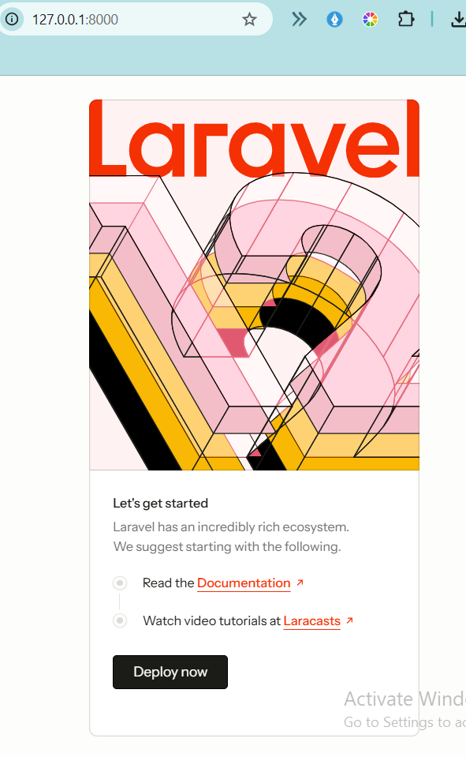
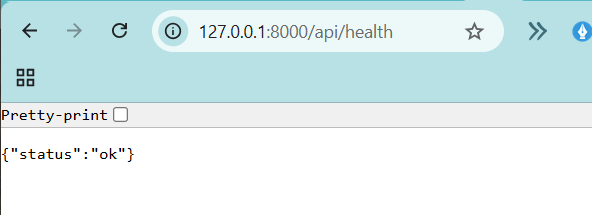
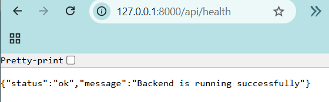
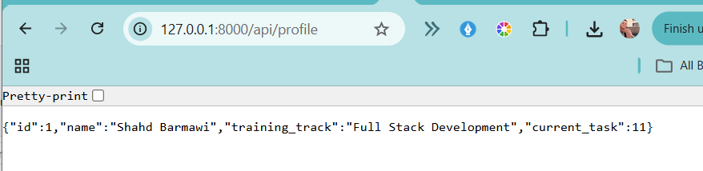
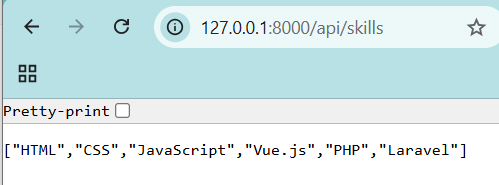
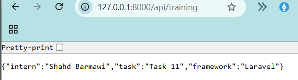
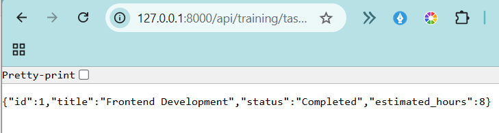
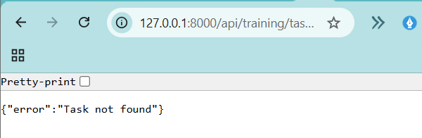
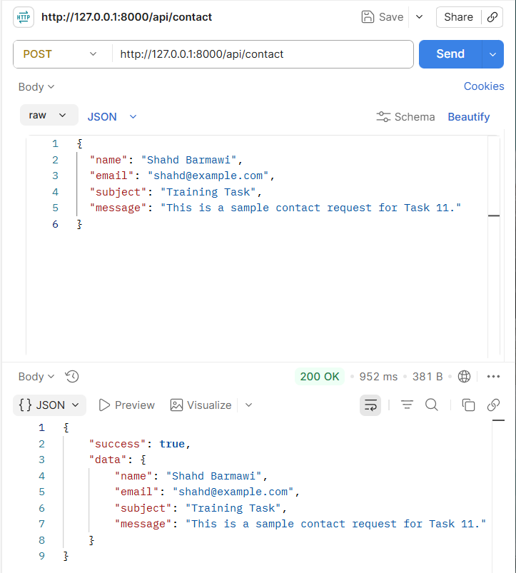
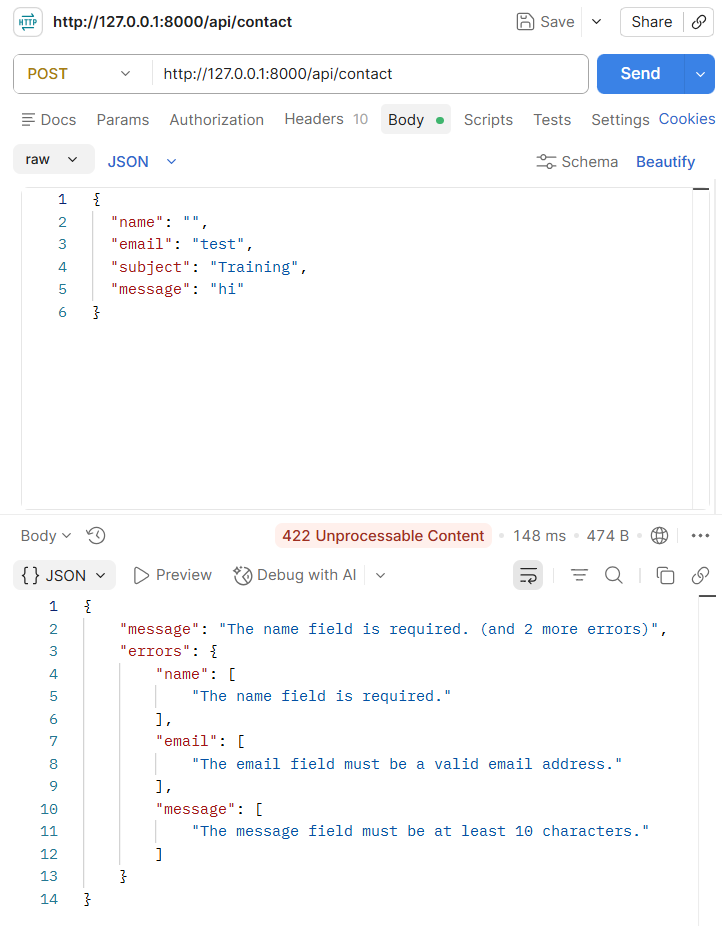

# Task 11 - Backend Foundations with PHP & Laravel

## Project Name and Task Objective

**Project Name:** Task 11 - Laravel API

The objective of this task is to establish a clean Laravel backend project, understand the Laravel framework structure and request lifecycle, and implement structured JSON API endpoints using routes and controllers.

The focus of this task is on backend foundations before database CRUD operations, authentication, and full-stack integration are introduced in future tasks.

---

## PHP and Laravel Versions Used

- PHP 8.2.12
- Laravel 12
- Composer 2.10.2

---

## Installation and Local Run Instructions

Navigate to the project folder:

```bash
cd task-11-laravel-api
```

Install the required dependencies:

```bash
composer install
```

Generate the application key:

```bash
php artisan key:generate
```

Run the local development server:

```bash
php artisan serve
```

The application runs locally at:

```text
http://127.0.0.1:8000
```

---

## Laravel Project Structure

### app/

Contains the main application logic.

### app/Http/Controllers/

Contains controller classes that process requests and return responses.

Controllers used in this project:

- HealthController
- TrainingController

### routes/

Contains the application's route definitions.

The API routes for this task are located in:

```text
routes/api.php
```

### config/

Contains the Laravel configuration files.

### database/

Contains database-related files such as migrations, factories, and seeders.

### public/

Contains publicly accessible files and Laravel's entry point.

### storage/

Contains application logs, cache files, compiled views, and other generated files.

### tests/

Contains automated tests.

### .env

Contains local environment configuration and sensitive values.

The `.env` file should never be uploaded to GitHub.

### .env.example

Contains an example of the required environment variables.

### Artisan

Laravel's command-line interface.

Examples:

```bash
php artisan serve
php artisan key:generate
php artisan migrate
```

### Composer

Composer is the PHP dependency manager.

Example:

```bash
composer install
```

---

## Implemented API Endpoints

| Method | Endpoint                 | Description                                                         |
| ------ | ------------------------ | ------------------------------------------------------------------- |
| GET    | /api/health              | Returns application status, application name, and a success message |
| GET    | /api/profile             | Returns a sample trainee profile                                    |
| GET    | /api/skills              | Returns a list of technical skills                                  |
| GET    | /api/training/tasks      | Returns all training tasks                                          |
| GET    | /api/training/tasks/{id} | Returns a specific task                                             |
| POST   | /api/contact             | Validates a contact request                                         |

---

## Successful JSON Response Example

Request:

```http
GET /api/training/tasks/1
```

Response:

```json
{
    "id": 1,
    "title": "Frontend Development",
    "status": "Completed",
    "estimated_hours": 8
}
```

---

## Error Response Example

Request:

```http
GET /api/training/tasks/100
```

Response:

```json
{
    "error": "Task not found"
}
```

HTTP Status:

```text
404 Not Found
```

---

## Summary of What I Learned

During Task 11, I learned how to:

- Create a Laravel project.
- Understand the Laravel project structure.
- Create API routes.
- Return JSON responses.
- Organize code using controllers.
- Use dynamic route parameters.
- Validate incoming requests.
- Return HTTP status codes.
- Test APIs using Postman.
- Use Artisan and Composer commands.

---

## Challenges, Blockers, or Questions Encountered

The latest Laravel version required PHP 8.3, while the installed PHP version was 8.2.12.

Another issue occurred because the PHP ZIP extension was disabled, which prevented Composer from completing the installation.

During API validation testing, Postman initially returned an HTML response instead of JSON. Adding the following header solved the problem:

```text
Accept: application/json
```

All issues were resolved successfully.

---

## Screenshots

### Laravel Application Running



---

### Health Endpoint



---

### Health Controller



---

### Profile Endpoint



---

### Skills Endpoint



---

### Training Tasks Endpoint



---

### Dynamic Task Endpoint



---

### 404 Error Response



---

### Successful Contact Request



---

### Contact Validation Error



---

# Task 12 - Laravel Database, Migrations, Eloquent Models & CRUD REST API

## Task Objective

The goal of this task was to convert the basic Laravel API from Task 11 into a database-driven REST API using MySQL, migrations, Eloquent models, controllers, validation, and CRUD operations.

---

## Project Continuation

Task 12 was implemented inside the existing `task-11-laravel-api` project without creating a new Laravel application.

---

## Database Setup

The application was connected to a local MySQL database.

Database configuration:

```env
DB_CONNECTION=mysql
DB_HOST=127.0.0.1
DB_PORT=3308
DB_DATABASE=task12_laravel_api
DB_USERNAME=root
DB_PASSWORD=
```

> Important: The `.env` file and database credentials were not uploaded to GitHub.

---

## Posts Database Structure

The `posts` table was created using Laravel migrations.

| Field      | Type      |
| ---------- | --------- |
| id         | bigint    |
| title      | string    |
| body       | text      |
| status     | enum      |
| created_at | timestamp |
| updated_at | timestamp |

The `status` field supports two values:

- draft
- published

---

## Migration Commands

Run migrations:

```bash
php artisan migrate
```

Refresh the database:

```bash
php artisan migrate:fresh
```

---

## Eloquent Model

A `Post` Eloquent model was created.

The following fields were configured using `$fillable`:

```php
protected $fillable = [
    'title',
    'body',
    'status',
];
```

All database operations were implemented using Eloquent ORM instead of raw SQL queries.

---

## Seeder

Sample data was generated using `PostSeeder`.

Run the seeder:

```bash
php artisan db:seed
```

Three sample posts were inserted into the database.

---

## CRUD REST API Endpoints

| Method | Endpoint          | Description       |
| ------ | ----------------- | ----------------- |
| GET    | `/api/posts`      | Return all posts  |
| GET    | `/api/posts/{id}` | Return one post   |
| POST   | `/api/posts`      | Create a new post |
| PUT    | `/api/posts/{id}` | Update a post     |
| PATCH  | `/api/posts/{id}` | Update a post     |
| DELETE | `/api/posts/{id}` | Delete a post     |

---

## Request Validation

Validation rules:

| Field  | Rule                         |
| ------ | ---------------------------- |
| title  | required, string, max:255    |
| body   | required, string             |
| status | required, draft or published |

Invalid requests return validation errors instead of saving incorrect data.

---

## Not Found Handling

When a post does not exist, the API returns:

```json
{
    "message": "Post not found"
}
```

with HTTP status code:

```text
404 Not Found
```

---

## Running the Project

Start the Laravel development server:

```bash
php artisan serve
```

The API runs on:

```text
http://127.0.0.1:8000
```

---

# Testing Screenshots

## 1. Successful Migrations

The database migrations were executed successfully.


---

## 2. Sample Records in Database

The database was populated with sample posts.


---

## 3. GET - List Posts

Returns all posts.


---

## 4. GET - View One Post

Returns one post by ID.


---

## 5. POST - Create Post

Creates a new post.


---

## 6. POST - Validation Error

Returns validation errors for invalid data.


---

## 7. PUT - Update Post

Updates an existing post.


---

## 8. DELETE - Delete Post

Deletes an existing post.


---

## 9. GET - 404 Not Found

Returns a 404 response for a non-existing post.


---

## 10. PUT - 404 Not Found

Returns a 404 response when updating a non-existing post.


---

## 11. DELETE - 404 Not Found

Returns a 404 response when deleting a non-existing post.


---

## Testing Summary

The API was tested using Postman.

The following operations were verified:

- List all posts.
- View one post.
- Create a valid post.
- Create an invalid post.
- Update a post.
- Delete a post.
- Request a non-existing post.
- Update a non-existing post.
- Delete a non-existing post.

All Task 12 requirements were completed successfully.

---

# Task 13 - Laravel Relationships, API Resources, Filtering & Pagination

## Overview

Task 13 extends the Laravel REST API developed in Tasks 11 and 12 by introducing relationships between database entities and improving the API response structure.

The backend was enhanced by adding categories, Eloquent relationships, API resources, filtering, sorting, pagination, validation, and eager loading.

---

## Categories Table and Model

A new `categories` table was created using a Laravel migration.

### Categories Table Structure

| Column     | Type      |
| ---------- | --------- |
| id         | bigint    |
| name       | string    |
| slug       | string    |
| created_at | timestamp |
| updated_at | timestamp |

A `Category` Eloquent model was created, and sample categories were added using a database seeder.

Sample categories:

- Technology
- Business
- Education

---

## Post and Category Relationship

The `posts` table was updated by adding a `category_id` foreign key using a new migration.

The relationship between the models was implemented as follows:

### Category Model

```php
public function posts()
{
    return $this->hasMany(Post::class);
}
```

### Post Model

```php
public function category()
{
    return $this->belongsTo(Category::class);
}
```

All seeded posts were linked to valid categories.

---

## Categories API Endpoint

The following endpoint was added to retrieve all categories:

```http
GET /api/categories
```

The response returns all available categories in JSON format.

---

## Create and Update Request Fields

The following fields are required when creating or updating a post:

| Field       | Type    | Required |
| ----------- | ------- | -------- |
| title       | string  | Yes      |
| body        | string  | Yes      |
| status      | string  | Yes      |
| category_id | integer | Yes      |

### Example Request

```json
{
    "title": "Laravel API",
    "body": "Testing a valid category.",
    "status": "published",
    "category_id": 1
}
```

Validation rules:

```php
$request->validate([
    'title' => 'required|string|max:255',
    'body' => 'required|string',
    'status' => 'required|in:draft,published',
    'category_id' => 'required|exists:categories,id',
]);
```

---

## Laravel API Resources

Two Laravel API Resources were created:

- PostResource
- CategoryResource

The Post API response includes:

- id
- title
- body
- status
- category information
- created_at
- updated_at

The same resource structure is used for both single-post and post-list responses.

---

## Available Posts Query Parameters

| Parameter   | Description                  |
| ----------- | ---------------------------- |
| search      | Search posts by title        |
| status      | Filter posts by status       |
| category_id | Filter posts by category     |
| sort_by     | Sort by title or created_at  |
| direction   | Sort direction (asc or desc) |
| page        | Navigate between pages       |

---

## Filtering Examples

### Search by Title

```http
GET /api/posts?search=First
```

### Filter by Status

```http
GET /api/posts?status=published
```

### Filter by Category

```http
GET /api/posts?category_id=2
```

### Combined Filters

```http
GET /api/posts?status=published&category_id=1
```

---

## Sorting Options

### Sort by Title

```http
GET /api/posts?sort_by=title&direction=asc
```

### Sort by Creation Date

```http
GET /api/posts?sort_by=created_at&direction=desc
```

Only `title` and `created_at` are allowed as sorting fields.

Only `asc` and `desc` are allowed as sorting directions.

---

## Pagination Behavior

The posts endpoint uses Laravel pagination.

The default page size is:

```text
2 posts per page
```

Examples:

```http
GET /api/posts?page=1
```

```http
GET /api/posts?page=2
```

The API response includes pagination metadata and navigation links.

---

## Query Efficiency

Eloquent eager loading was implemented using:

```php
Post::with('category');
```

This prevents unnecessary database queries when returning posts with their categories.

---

## Migration and Seeding Commands

Run the following commands to recreate the database locally:

```bash
php artisan migrate:fresh
```

Seed the database:

```bash
php artisan db:seed
```

Or run both commands together:

```bash
php artisan migrate:fresh --seed
```

---

## API Testing

The following functionality was tested using Postman:

- GET categories
- GET posts with category information
- Create a post with a valid category
- Update a post with a valid category
- Invalid category validation
- Search by title
- Filter by status
- Filter by category
- Combined filters
- Sorting
- Pagination
- GET single post
- DELETE post

---

## Status

**Task 13 completed successfully.**
